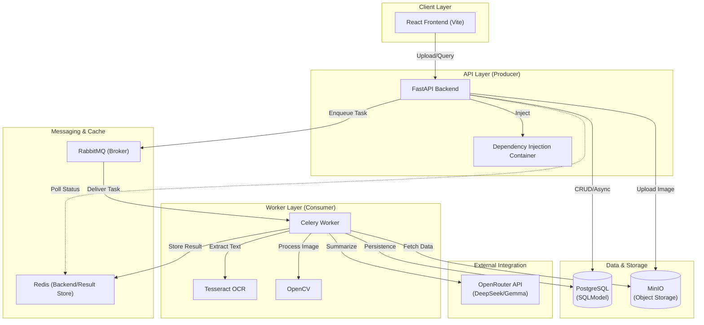
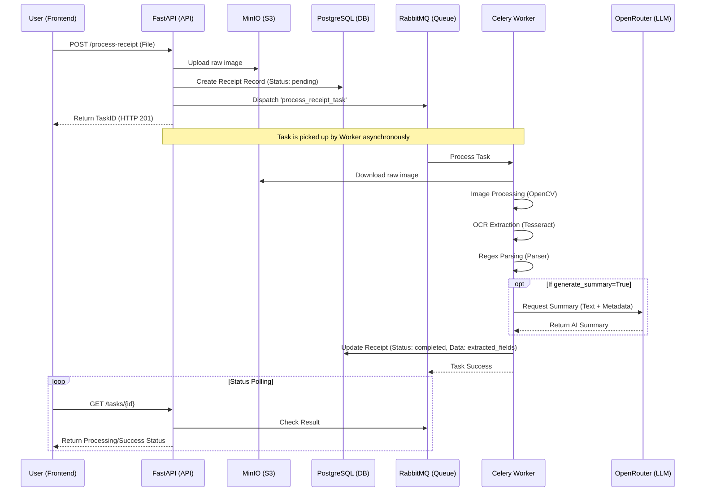

# 🏗 System Architecture: Receipt Processor

This document provides a deep dive into the architectural design, component interactions, and data flow of the Automated Receipt Processor.

---

## 🔝 High-Level System Architecture

The following diagram illustrates the relationship between the core components of the system. I use a distributed architecture to separate the highly-available API layer from the compute-intensive vision and AI tasks.

---

## 🔄 Receipt Processing Flow (Sequence Diagram)

This diagram tracks the lifecycle of a single receipt upload request through the system.

---

## 🧩 Component Breakdown

### 1. The Producer: FastAPI
The API layer ([app/main.py](file:///c:/Users/HP/Desktop/files/just_a_proejct/fast%20api/receipt-processor/app/main.py)) acts as the entry point. It handles file validation and orchestration.
- **Why Async?**: I use `asyncpg` to ensure that database I/O does not block the event loop, allowing the API to handle high volumes of concurrent status checks and history queries.
- **Repository Pattern**: Located in `app/repositories/`, this layer abstracts SQLModel queries, ensuring the API doesn't care about the underlying database implementation.

### 2. The Broker: RabbitMQ
- **Role**: Mediates communication between the API and workers. 
- **Why RabbitMQ?**: Unlike Redis, RabbitMQ provides robust message durability and complex routing capabilities, ensuring that no receipt processing job is "lost" if a worker crashes.

### 3. The Backend: Redis
- **Role**: Stores Task states and results.
- **Why Redis?**: Status polling requires extremely low latency. Redis excels at storing the ephemeral state of active tasks.

### 4. The Consumer: Celery Worker
The worker ([app/services/tasks.py](file:///c:/Users/HP/Desktop/files/just_a_proejct/fast%20api/receipt-processor/app/services/tasks.py)) performs the "heavy lifting". 
- **Isolated Context**: Since workers run in a separate process, they utilize the `get_sync_session_context` from `app.db` to manually manage database connections safely without the FastAPI request-response lifecycle.

---

## 📂 Data Models & State Lifecycle

I track the state of a receipt using a `status` field in the `Receipt` model ([app/models/receipt_db.py](file:///c:/Users/HP/Desktop/files/just_a_proejct/fast%20api/receipt-processor/app/models/receipt_db.py)).

1.  **PENDING**: The record is created in the DB, and the task is enqueued.
2.  **PROCESSING**: (Implicitly managed by Celery `STARTED` state).
3.  **COMPLETED**: Business logic finished, all data (Merchant, Total, etc.) is persisted.
4.  **ERROR**: An exception occurred (e.g., OCR failure, LLM timeout).

---

## 🛠 Internal Service Logic

The worker utilizes a chain of specialized services located in `app/services/`:

1.  **[storage.py](file:///c:/Users/HP/Desktop/files/just_a_proejct/fast%20api/receipt-processor/app/services/storage.py)**: Handles object retrieval from MinIO.
2.  **[image.py](file:///c:/Users/HP/Desktop/files/just_a_proejct/fast%20api/receipt-processor/app/services/image.py)**: Applies CV2 thresholding/grayscaling.
3.  **[ocr.py](file:///c:/Users/HP/Desktop/files/just_a_proejct/fast%20api/receipt-processor/app/services/ocr.py)**: Performs Tesseract text extraction.
4.  **[parser.py](file:///c:/Users/HP/Desktop/files/just_a_proejct/fast%20api/receipt-processor/app/services/parser.py)**: Runs regex heuristics to extract structured data from raw text.
5.  **[analysis.py](file:///c:/Users/HP/Desktop/files/just_a_proejct/fast%20api/receipt-processor/app/services/analysis.py)**: Validates totals and dates against business rules.

---

## 🏗 Producer-Consumer Pattern: Explanation

In this architecture, the **FastAPI application is the Producer**. It does not perform any analysis; it merely accepts the "job" and places it on the "belt" (RabbitMQ). 

The **Celery Worker is the Consumer**. It watches the belt and processes jobs as they arrive.
- **Scaling**: We can scale the Producer to handle more web traffic or the Consumer to handle more images simply by spinning up more containers.
- **Reliability**: If the Worker is busy or down, the messages stay in RabbitMQ until a worker becomes available.

---

## 👨‍💻 Developer Onboarding & Debugging

### Debugging the Worker
The worker runs with `hot-reload` enabled via `watchfiles` in development mode.
- View logs: `docker logs -f receipt_worker`
- The worker will automatically restart when you edit files in `app/services/`.

### Monitoring the Queue
RabbitMQ provides a web UI for monitoring message counts and consumer health.
- **URL**: `http://localhost:15672`
- **User/Pass**: `guest` / `guest`

### Accessing MinIO (Object Store)
- **URL**: `http://localhost:9001`
- **Access/Secret**: `minioadmin` / `minioadmin`
